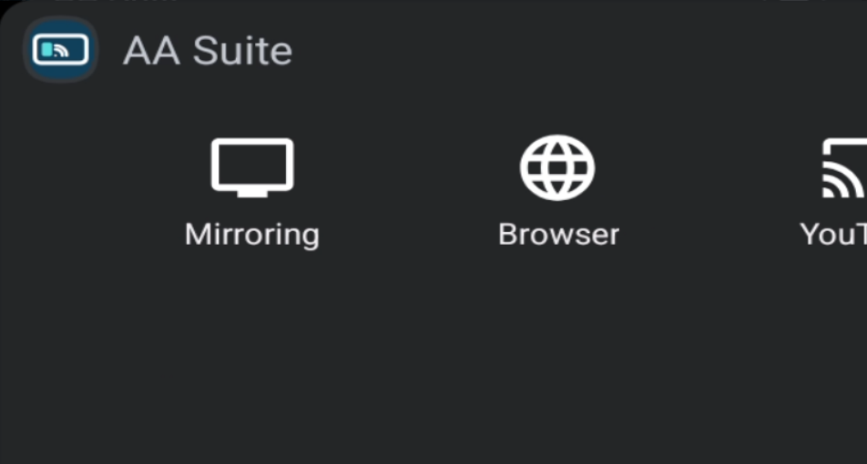
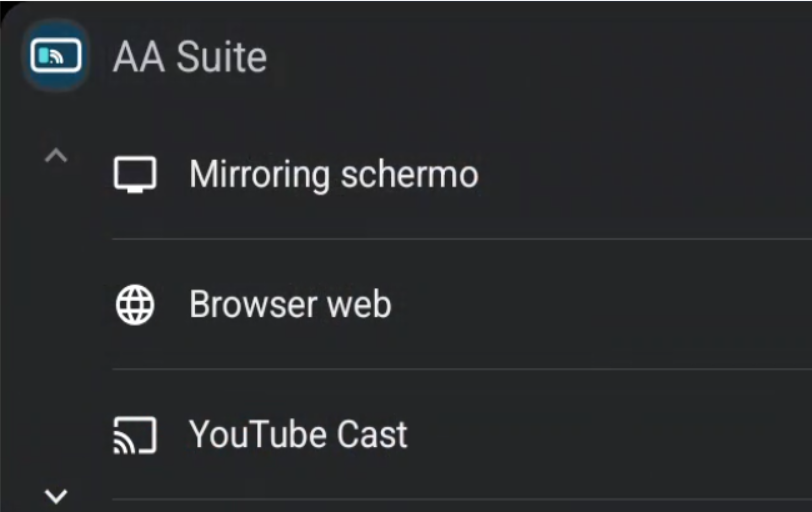
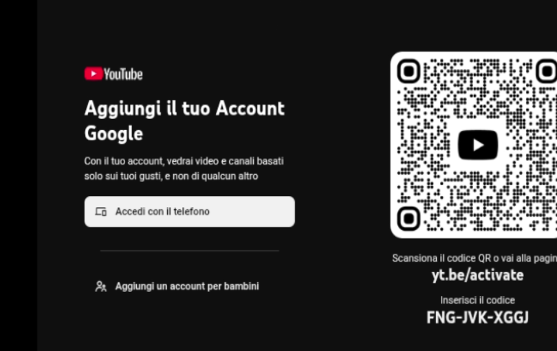
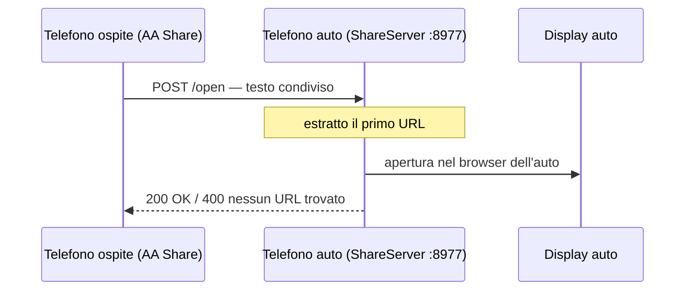
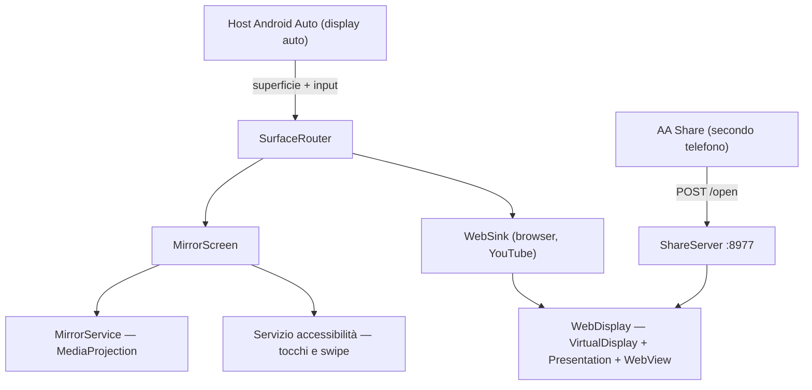

# AA Suite

**Mirroring dello schermo, un browser web e l'interfaccia TV di YouTube sul display Android Auto dell'auto.**

[](https://developer.android.com/training/cars)
[](https://apilevels.com/)
[](https://kotlinlang.org/)
[](#distribuzione)
[](LICENSE)

🇬🇧 [Read in English](README.md)

Android Auto offre mappe, musica e messaggi. AA Suite aggiunge le tre cose che
lascia deliberatamente fuori: **lo schermo del telefono**, un **browser web
vero** e **YouTube in modalità TV**, che un passeggero comanda dal proprio
telefono con il normale tasto "trasmetti".

Funziona registrandosi come app auto di categoria *navigazione* — l'unica a cui
viene concesso `ACCESS_SURFACE` — e da lì disegna sulla superficie dell'auto
quello che vuole.

> [!IMPORTANT]
> **Uso personale.** L'app non è pubblicabile sul Play Store: duplicare lo
> schermo del telefono e mostrare contenuti web sul display dell'auto sono
> entrambe cose che le norme Play per Android Auto non consentono in
> distribuzione pubblica. Si installa dal canale **Test interno** di Play
> Console. Vedi [Distribuzione](#distribuzione).

---

## Indice

- [Il menu dell'auto](#il-menu-dellauto)
- [Le tre modalità](#le-tre-modalità)
- [Condividere un link dal secondo telefono](#condividere-un-link-dal-secondo-telefono)
- [Impostazioni](#impostazioni)
- [Architettura](#architettura)
- [Requisiti](#requisiti)
- [Compilazione](#compilazione)
- [Configurazione del telefono](#configurazione-del-telefono)
- [Provare senza auto](#provare-senza-auto)
- [Distribuzione](#distribuzione)
- [Test](#test)
- [Limiti noti](#limiti-noti)
- [Licenza](#licenza)

---

## Il menu dell'auto

| Griglia (predefinito) | Lista |
|---|---|
|  |  |

Il layout è una preferenza, si cambia dalla schermata **Impostazioni** dietro
l'icona ⚙ in alto a destra.

---

## Le tre modalità

### Mirroring schermo

Porta lo schermo del telefono sul display dell'auto.

- `MediaProjection` alimenta un `VirtualDisplay` che scrive direttamente sulla
  superficie dell'auto, senza passaggi intermedi
- **Tocchi e scorrimenti** fatti sul display auto vengono rimappati in coordinate
  del telefono e riprodotti come gesture reali tramite un servizio di
  accessibilità
- Barra azioni: menu · play/pausa · indietro · home
- Due rese: **aspect-fit** (schermo intero, bande nere) oppure **riempi schermo**
  (center-crop, bordi tagliati)
- Durante il mirroring la luminosità del telefono può scendere al minimo: il
  display dell'auto non ne risente, la batteria sì

### Browser web

Un browser vero e proprio renderizzato sul display dell'auto.

- Una `WebView` vive su un `VirtualDisplay` privato mostrato da una
  `Presentation`, alimentato dalla superficie dell'auto
- I tocchi dell'auto diventano `MotionEvent` iniettati nella gerarchia di view
- **Preferiti** modificati dal telefono e sfogliati dall'auto
- Ricerca Google o URL diretto dalla schermata di ricerca dell'auto
- Dal telefono si può spingere una pagina sul display dell'auto con un tocco

### YouTube Cast

Il telefono collegato all'auto si comporta come una **smart TV YouTube**.



- Carica `youtube.com/tv` dietro uno user-agent smart-TV, che restituisce
  l'interfaccia leanback
- Il display dell'auto è più stretto di una TV, quindi la WebView **riduce lo
  zoom** finché la pagina non dispone di un viewport da 1280 px in cui
  comporsi, invece di essere schiacciata
- **Abbinamento una tantum**: sull'auto Impostazioni → *Collega con codice TV*;
  sul telefono del passeggero YouTube → *Guarda sulla TV* → inserisci il codice.
  Passa da internet, quindi non serve una rete comune, e sopravvive ai riavvii
  nei cookie della WebView
- Da quel momento il tasto "trasmetti" del passeggero manda i video all'auto
- L'audio esce dalle casse dell'auto attraverso Android Auto stesso

> [!NOTE]
> **Fuori portata:** fare da ricevitore per Netflix, Disney+ o Prime Video.
> Quelle app parlano solo con ricevitori Chromecast certificati con DRM
> hardware — nessuna app di terze parti può sostituirsi a loro.

---

## Condividere un link dal secondo telefono

Un passeggero può mandare qualsiasi link al display dell'auto tramite la normale
condivisione di Android.



- **AA Share** (modulo `companion/`) è un'app minima che compare nel menu di
  condivisione e invia il testo al telefono dell'auto
- La destinazione è il **gateway DHCP** della rete: lo scenario previsto è
  l'hotspot del telefono dell'auto
- Lato auto `ShareServer` è un server HTTP su socket puri, vivo quanto la
  sessione Android Auto, che estrae il primo URL dal testo e lo apre nel browser

---

## Impostazioni

Dietro l'icona ⚙ del menu principale:

| Voce | Cosa fa |
|---|---|
| **Layout menu** | Griglia o lista |
| **Blocco rotazione orizzontale** | Forza il telefono in orizzontale con una finestra overlay invisibile — utile durante il mirroring |
| **Riempi schermo** | Center-crop dello schermo duplicato; nelle modalità web ritaglia il video perché copra tutto il display |

Layout e riempi-schermo sono salvati e sopravvivono al riavvio. Il blocco
rotazione è volatile per natura: riflette se l'overlay è attivo in quel momento.

---

## Architettura



Un solo `SurfaceCallback` è registrato per sessione: `SurfaceRouter` lo possiede
e scambia sotto di sé la modalità attiva, perché l'host non riemette
`onSurfaceAvailable` quando il callback cambia.

### Moduli

| Modulo | Contenuto |
|---|---|
| `app/` | L'app principale, installata sul telefono che si collega all'auto |
| `companion/` | **AA Share**, per il telefono del passeggero |

### Package

| Package | Responsabilità |
|---|---|
| `core/` | Logica pura e testabile: calcoli di fit e fill, mappatura dei tocchi, percorso del gesto di scorrimento, viewport web, risoluzione URL, riduttore di stato del mirroring |
| `mirror/` | Servizio in foreground, `MediaProjection`, astrazione `FrameSource`, resa a schermo pieno |
| `car/` | Schermate della Car App Library e arbitro della superficie |
| `browser/` | `WebDisplay`: una WebView su display virtuale, con tocco, scorrimento e indietro |
| `input/` | Accessibilità (tocco, swipe, indietro, home), tasti media, blocco rotazione, risparmio luminosità |
| `share/` | Server HTTP di condivisione e parsing del testo ricevuto |
| `setup/` | Activity di configurazione sul telefono, preferiti, preferenze |

### Tre cose che vale la pena sapere

**Lo scorrimento è un dito, non un `scrollBy`.** L'host riporta lo scorrimento
come una raffica di piccole distanze. Riprodurle con `WebView.scrollBy()` muove
solo il documento radice, che una pagina moderna non scorre mai: il contenuto sta
in contenitori con overflow proprio. AA Suite le ripiega invece in **un unico
trascinamento reale**: `ACTION_DOWN` al centro, una scia di `ACTION_MOVE`, e il
dito si stacca 140 ms dopo l'ultimo evento. Così scorre qualunque contenitore si
trovi sotto.

**Il display virtuale non può superare la superficie.** L'host disegna il buffer
pixel per pixel, quindi un `VirtualDisplay` più grande della superficie produce
un ritaglio ingrandito, non più spazio. Per dare a una pagina TV il viewport
largo che si aspetta si cambia lo zoom della WebView, non la risoluzione del
display.

**Il tasto indietro di una TV non è la cronologia del browser.** L'interfaccia TV
di YouTube gestisce da sé la navigazione e lascia vuota la history della WebView,
quindi `goBack()` non ha dove tornare. Il ritorno le arriva come `keydown` con i
codici del tasto back dei telecomandi (Escape, webOS, Tizen), iniettato via
JavaScript: un key event nativo richiederebbe che la WebView abbia il focus, cosa
che dentro una `Presentation` non accade mai.

---

## Requisiti

- Telefono Android 8+ (`minSdk 26`), consigliato 10+
- App **Android Auto** installata sul telefono
- Auto o unità principale con Android Auto via USB — sviluppata e provata su
  Nissan Qashqai J12 e su Desktop Head Unit

## Compilazione

```bash
./gradlew installDebug             # app principale, telefono in debug USB
./gradlew :companion:installDebug  # AA Share, sul telefono del passeggero
./gradlew test                     # test unitari
./gradlew bundleRelease            # AAB firmato per Play Console
```

La firma di release legge `keystore/keystore.properties` e il relativo keystore,
entrambi fuori dal controllo di versione; senza di essi la configurazione di
firma viene semplicemente saltata e le build di debug funzionano comunque.

## Configurazione del telefono

Una tantum:

1. App **Android Auto** → Impostazioni → tocca dieci volte su *Versione* per
   sbloccare la modalità sviluppatore
2. ⋮ → **Impostazioni sviluppatore** → attiva **Fonti sconosciute** (necessario
   per le build installate via adb)
3. Impostazioni → **Personalizza launcher** → attiva **AA Suite**
4. Apri AA Suite sul telefono e concedi: cattura schermo, servizio di
   accessibilità e "Mostra sopra altre app"

## Provare senza auto

```bash
# Android Studio → SDK Manager → SDK Tools → Android Auto Desktop Head Unit
# Sul telefono: Android Auto → Impostazioni sviluppatore → Avvia server unità principale
adb forward tcp:5277 tcp:5277
"$LOCALAPPDATA/Android/Sdk/extras/google/auto/desktop-head-unit.exe"
```

L'ordine conta: il server sul telefono deve essere già in ascolto quando parte il
DHU, altrimenti resta fermo su *Waiting for phone*. Un file
`~/.android/headunit.ini` fissa la risoluzione del display emulato, utile prima
di catturare screenshot.

## Distribuzione

Le app Android Auto basate su template **non compaiono sulle auto reali** se non
sono state installate dal Play Store, anche con le fonti sconosciute attive.
Provare in macchina significa quindi caricare l'AAB nel canale **Test interno**
di Play Console e installare da lì.

## Test

I test unitari coprono la logica pura in `core/`, senza dipendenze Android:
geometria di fit e fill, mappatura dei tocchi dall'auto al telefono, percorso del
gesto di scorrimento, zoom del viewport web, riduttore di stato del mirroring,
parsing degli URL condivisi, codifica dei preferiti e gestione HTTP del server di
condivisione.

```bash
./gradlew test
```

## Limiti noti

- **YouTube Cast, tasto indietro:** servono due pressioni per uscire da un video
  — la causa non è ancora isolata
- **Video 16:9 su display 2:1:** restano bande laterali, a meno di attivare
  *riempi schermo*, che in cambio ritaglia l'immagine
- **Ricezione cast da Netflix, Disney+, Prime Video:** impossibile per licenze e
  DRM, non è un difetto in attesa di correzione

## Licenza

[MIT](LICENSE) © 2026 iAlias
