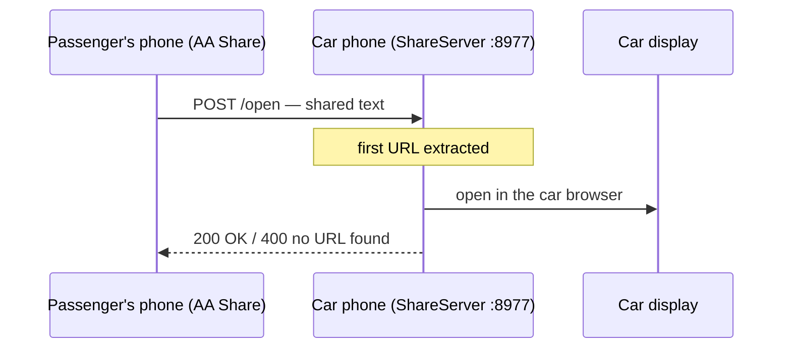
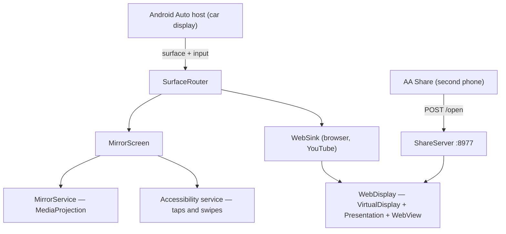

# AA Suite

**Screen mirroring, a web browser and YouTube's TV interface on your car's Android Auto display.**

[](https://developer.android.com/training/cars)
[](https://apilevels.com/)
[](https://kotlinlang.org/)
[](#distribution)
[](LICENSE)

🇮🇹 [Leggi in italiano](README.it.md)

Android Auto gives you maps, music and messages. AA Suite adds the three things
it deliberately leaves out: **your phone's screen**, a **real web browser**, and
**YouTube in TV mode**, which a passenger can drive from their own phone with the
ordinary cast button.

It works by registering as a *navigation* car app — the only category granted
`ACCESS_SURFACE` — and then drawing whatever it likes on the car's surface.

> [!IMPORTANT]
> **Personal use.** This app cannot be published on the Play Store: mirroring a
> phone screen and showing web content on the car display are both outside what
> Play's Android Auto policies allow for public distribution. It is installed
> through Play Console's **internal testing** track. See [Distribution](#distribution).

---

## Contents

- [The car menu](#the-car-menu)
- [The three modes](#the-three-modes)
- [Sharing a link from a second phone](#sharing-a-link-from-a-second-phone)
- [Settings](#settings)
- [Architecture](#architecture)
- [Requirements](#requirements)
- [Building](#building)
- [One-time phone setup](#one-time-phone-setup)
- [Running without a car](#running-without-a-car)
- [Distribution](#distribution)
- [Testing](#testing)
- [Known limitations](#known-limitations)
- [License](#license)

---

## The car menu

| Grid (default) | List |
|---|---|
|  |  |

The layout is a preference, switched from the **Settings** screen behind the ⚙
action in the top right.

---

## The three modes

### Screen mirroring

Puts the phone's screen on the car display.

- `MediaProjection` feeds a `VirtualDisplay` that writes straight onto the car's
  surface, with nothing in between
- **Taps and swipes** made on the car display are mapped back into phone
  coordinates and replayed as real gestures through an accessibility service
- Action bar: menu · play/pause · back · home
- Two renderings: **aspect-fit** (whole screen, black bars) or **fill screen**
  (center-crop, edges trimmed)
- The phone's brightness can drop to its minimum while mirroring — the car
  display is unaffected, the battery is not

### Web browser

A genuine browser rendered on the car display.

- A `WebView` lives on a private `VirtualDisplay` shown through a `Presentation`,
  backed by the car surface
- Car taps become `MotionEvent`s dispatched into the view hierarchy
- **Bookmarks** are edited on the phone and browsed from the car
- Google search or a direct URL from the car's search screen
- A page can also be pushed from the phone to the car display with one tap

### YouTube Cast

The phone connected to the car behaves like a **YouTube smart TV**.


- Loads `youtube.com/tv` behind a smart-TV user agent, which serves the leanback
  interface
- The car display is narrower than a TV, so the WebView **zooms out** until the
  page has a 1280px viewport to lay itself out in, instead of being squeezed
- **Pair once**: on the car, Settings → *Link with TV code*; on the passenger's
  phone, YouTube → *Watch on TV* → enter the code. It goes over the internet, so
  no shared network is needed, and it survives restarts in the WebView's cookies
- From then on the passenger's cast button sends videos to the car
- Audio comes out of the car speakers through Android Auto itself

> [!NOTE]
> **Out of reach:** acting as a receiver for Netflix, Disney+ or Prime Video.
> Those apps only talk to certified Chromecast receivers with hardware DRM — no
> third-party app can stand in for one.

---

## Sharing a link from a second phone

A passenger can send any link to the car display through Android's ordinary
share sheet.



- **AA Share** (the `companion/` module) is a minimal app that appears in the
  share sheet and posts the text to the car phone
- The destination is the network's **DHCP gateway** — the intended setup is the
  car phone's hotspot
- On the car side `ShareServer` is a bare-sockets HTTP server, alive for as long
  as the Android Auto session, which pulls the first URL out of the text and
  opens it in the car browser

---

## Settings

Behind the ⚙ action on the main menu:

| Setting | What it does |
|---|---|
| **Menu layout** | Grid or list |
| **Landscape rotation lock** | Forces the phone into landscape through an invisible overlay window — useful while mirroring |
| **Fill screen** | Center-crops the mirrored screen; in the web modes it crops the video to cover the whole display |

Layout and fill-screen persist across restarts. The rotation lock is volatile by
nature: it reflects whether the overlay is currently up.

---

## Architecture



Exactly one `SurfaceCallback` is registered per session: `SurfaceRouter` owns it
and swaps the active mode underneath, because the host does not re-deliver
`onSurfaceAvailable` when the callback changes.

### Modules

| Module | Contents |
|---|---|
| `app/` | The main app, installed on the phone that plugs into the car |
| `companion/` | **AA Share**, for the passenger's phone |

### Packages

| Package | Responsibility |
|---|---|
| `core/` | Pure, testable logic: aspect fit/fill maths, touch mapping, scroll gesture path, web viewport, URL resolution, mirror state reducer |
| `mirror/` | Foreground service, `MediaProjection`, the `FrameSource` abstraction, fill rendering |
| `car/` | Car App Library screens and the surface arbiter |
| `browser/` | `WebDisplay`: a WebView on a virtual display, with touch, scrolling and back |
| `input/` | Accessibility (tap, swipe, back, home), media keys, rotation lock, brightness saver |
| `share/` | The share HTTP server and parsing of the received text |
| `setup/` | Phone-side setup activity, bookmarks, preferences |

### Three things worth knowing

**Scrolling is a finger, not a `scrollBy`.** The host reports scrolling as a
stream of small distances. Replaying each one through `WebView.scrollBy()` moves
only the root document, which a modern page never scrolls — its content sits in
containers with their own overflow. AA Suite folds them into **one real drag**
instead: `ACTION_DOWN` at the centre, a trail of `ACTION_MOVE`, and the finger
lifts 140 ms after the last event. That scrolls whatever container is under it.

**The virtual display cannot outgrow the surface.** The host paints the buffer
pixel for pixel, so a `VirtualDisplay` larger than the surface produces a
magnified crop, not more room. To give a TV page the wide viewport it expects you
change the WebView's zoom, not the display's resolution.

**A TV's back button is not the browser history.** YouTube's TV interface routes
navigation itself and leaves the WebView history empty, so `goBack()` has nowhere
to go. Back reaches it as a `keydown` carrying the remote back-key codes
(Escape, webOS, Tizen), injected through JavaScript — a native key event would
need the WebView to hold the focus, which it never does inside a `Presentation`.

---

## Requirements

- Android 8+ phone (`minSdk 26`), 10+ recommended
- The **Android Auto** app installed on the phone
- A car or head unit with Android Auto over USB — developed and tested against a
  Nissan Qashqai J12 and the Desktop Head Unit

## Building

```bash
./gradlew installDebug             # main app, phone in USB debugging
./gradlew :companion:installDebug  # AA Share, on the passenger's phone
./gradlew test                     # unit tests
./gradlew bundleRelease            # signed AAB for Play Console
```

Release signing reads `keystore/keystore.properties` and its keystore, both kept
out of version control; without them the signing config is simply skipped and
debug builds still work.

## One-time phone setup

1. **Android Auto** app → Settings → tap *Version* ten times to unlock developer
   mode
2. ⋮ → **Developer settings** → enable **Unknown sources** (required for builds
   installed over adb)
3. Settings → **Customise launcher** → enable **AA Suite**
4. Open AA Suite on the phone and grant: screen capture, the accessibility
   service, and "Display over other apps"

## Running without a car

```bash
# Android Studio → SDK Manager → SDK Tools → Android Auto Desktop Head Unit
# On the phone: Android Auto → Developer settings → Start head unit server
adb forward tcp:5277 tcp:5277
"$LOCALAPPDATA/Android/Sdk/extras/google/auto/desktop-head-unit.exe"
```

Order matters: the phone's server must already be listening when the DHU starts,
or it sits on *Waiting for phone*. A `~/.android/headunit.ini` pins the emulated
display's resolution, which is worth setting before taking screenshots.

## Distribution

Template-based Android Auto apps **do not appear on real cars** unless they were
installed from the Play Store, even with unknown sources enabled. Testing in an
actual car therefore means uploading the AAB to Play Console's **internal
testing** track and installing from there.

## Testing

Unit tests cover the pure logic in `core/`, with no Android dependencies: fit and
fill geometry, car-to-phone touch mapping, the scroll gesture path, web viewport
zoom, the mirror state reducer, shared-URL parsing, bookmark encoding, and the
share server's HTTP handling.

```bash
./gradlew test
```

## Known limitations

- **YouTube Cast, back button:** it takes two presses to leave a video — the
  cause has not been isolated yet
- **16:9 video on a 2:1 display:** side bars remain unless *fill screen* is on,
  which crops the picture in exchange
- **Receiving casts from Netflix, Disney+, Prime Video:** impossible by licensing
  and DRM, not a bug waiting to be fixed

## License

[MIT](LICENSE) © 2026 iAlias
