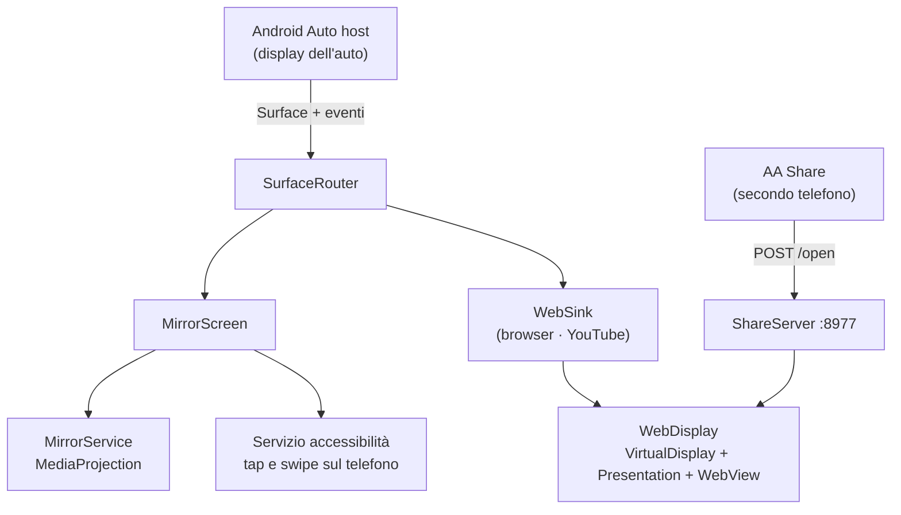

# AA Suite

Un'app Android Auto che porta sul display dell'auto tre cose che il sistema
non offre: **lo schermo del telefono**, un **browser web** e **YouTube in
modalità TV**, comandabile dal telefono di un passeggero come se fosse una
smart TV.

Funziona sfruttando la categoria *navigazione* della Car App Library, l'unica
che concede il permesso `ACCESS_SURFACE`: da lì l'app disegna sulla superficie
dell'auto quello che vuole.

> **Uso personale.** L'app non è pubblicabile sullo store: duplica lo schermo e
> mostra contenuti web sul display dell'auto, cose che le norme Play per
> Android Auto non consentono in distribuzione pubblica. Va installata dal
> canale **Test interno** di Play Console (vedi [Distribuzione](#distribuzione)).

---

## Il menu dell'auto

| Griglia (predefinito) | Lista |
|---|---|
|  |  |

Il layout si cambia dalla schermata **Impostazioni**, raggiungibile con l'icona
⚙ in alto a destra.

*(La griglia è catturata nell'emulatore Desktop Head Unit, che ritaglia il lato
destro della finestra: sul display reale le tre celle sono tutte visibili.)*

---

## Le tre modalità

### 1. Mirroring schermo

Duplica lo schermo del telefono sul display dell'auto.

- `MediaProjection` alimenta un `VirtualDisplay` che scrive direttamente sulla
  Surface dell'auto, senza passaggi intermedi
- **Tocchi e scorrimenti** fatti sul display auto vengono rimappati in
  coordinate del telefono e reiniettati come gesture reali tramite un servizio
  di accessibilità
- Barra azioni: menu · play/pausa · indietro · home
- Due rese possibili: **aspect-fit** (immagine intera, bande nere) oppure
  **riempi schermo** (center-crop, bordi tagliati)
- Durante il mirroring la luminosità del telefono può essere portata al minimo
  per risparmiare batteria, lasciando intatto quello che si vede in auto

### 2. Browser web

Un browser vero e proprio renderizzato sul display dell'auto.

- Una `WebView` vive su un `VirtualDisplay` privato mostrato da una
  `Presentation`; il display è alimentato dalla Surface dell'auto
- I tocchi dell'auto diventano `MotionEvent` iniettati nella gerarchia di view
- **Preferiti** gestiti dal telefono e sfogliabili dall'auto
- Ricerca Google o URL diretto dalla schermata di ricerca dell'auto
- Dal telefono si può spingere una pagina sul display dell'auto con un tocco

### 3. YouTube Cast

Il telefono collegato all'auto si comporta come una **smart TV YouTube**.


- Carica `youtube.com/tv` con uno user-agent smart-TV, ottenendo l'interfaccia
  leanback
- Il display auto è più stretto di una TV: la WebView **riduce lo zoom** finché
  la pagina non dispone di un viewport da 1280 px, così l'interfaccia TV si
  compone con le proporzioni giuste invece di essere schiacciata
- **Abbinamento una tantum**: sull'auto Impostazioni → *Collega con codice TV*,
  sul telefono del passeggero YouTube → *Guarda sulla TV* → inserisci il codice.
  Funziona via internet, non serve una rete comune, e resta memorizzato nei
  cookie della WebView
- Da quel momento il tasto "trasmetti" del passeggero manda i video sull'auto
- L'audio esce dalle casse dell'auto attraverso Android Auto

> **Fuori portata:** fare da ricevitore per Netflix, Disney+ o Prime Video.
> Quelle app parlano solo con ricevitori Chromecast certificati con DRM
> hardware — nessuna app di terze parti può sostituirsi a loro.

---

## Condividere un link dal secondo telefono

Un passeggero può mandare qualsiasi link sul display dell'auto tramite la
normale condivisione di Android.

```
┌──────────────────┐   POST /open    ┌────────────────────┐
│ Telefono ospite  │ ──────────────► │ Telefono dell'auto │
│  app AA Share    │   porta 8977    │  ShareServer       │
└──────────────────┘                 └─────────┬──────────┘
                                               │ primo URL nel testo
                                               ▼
                                     Browser sul display auto
```

- **AA Share** (modulo `companion/`) è un'app minima che compare nel menu di
  condivisione e invia il testo al telefono dell'auto
- L'indirizzo di destinazione è il **gateway DHCP** della rete: lo scenario
  previsto è l'hotspot del telefono dell'auto
- Lato auto, `ShareServer` è un server HTTP essenziale su socket puri, vivo
  quanto la sessione Android Auto: estrae il primo URL dal testo ricevuto e lo
  apre nel browser dell'auto

---

## Impostazioni

Raggiungibili con ⚙ dal menu principale:

| Voce | Cosa fa |
|---|---|
| **Layout menu** | Griglia o lista |
| **Blocco rotazione orizzontale** | Forza il telefono in orizzontale con una finestra overlay invisibile, utile durante il mirroring |
| **Riempi schermo** | Center-crop del mirroring; nelle modalità web ritaglia il video perché copra tutto il display |

Layout e riempi-schermo sono salvati e sopravvivono al riavvio; il blocco
rotazione è volatile per natura, dipende dall'overlay attivo.

---

## Architettura



Un solo `SurfaceCallback` è registrato per sessione: `SurfaceRouter` fa da
arbitro e scambia sotto di esso la modalità che possiede la superficie, perché
l'host non riemette `onSurfaceAvailable` quando cambia il callback.

### Moduli

| Modulo | Contenuto |
|---|---|
| `app/` | L'app principale, installata sul telefono collegato all'auto |
| `companion/` | **AA Share**, per il telefono del passeggero |

### Package

| Package | Responsabilità |
|---|---|
| `core/` | Logica pura e testabile: calcolo aspect-fit/fill, mappatura dei tocchi, gesto di scorrimento, viewport web, risoluzione URL, stato del mirroring |
| `mirror/` | Servizio in foreground, `MediaProjection`, astrazione `FrameSource`, resa a schermo pieno |
| `car/` | Le schermate della Car App Library e l'arbitro della Surface |
| `browser/` | `WebDisplay`: WebView su display virtuale, con tocco, scorrimento e tasto indietro |
| `input/` | Accessibilità (tap, swipe, indietro, home), tasti media, blocco rotazione, risparmio luminosità |
| `share/` | Server HTTP di condivisione e parsing del testo ricevuto |
| `setup/` | Activity di configurazione sul telefono, preferiti, preferenze |

### Dettagli che vale la pena conoscere

**Lo scorrimento è un dito, non un `scrollBy`.** L'host riporta lo scorrimento
come una raffica di piccole distanze. Applicarle con `WebView.scrollBy()` muove
soltanto il documento radice, che le pagine moderne non scorrono mai: il
contenuto sta in contenitori con overflow interno. AA Suite le ripiega invece
in **un unico trascinamento reale** — un `ACTION_DOWN` al centro, una scia di
`ACTION_MOVE`, e il dito si stacca dopo 140 ms di inattività — così scorre
qualunque contenitore si trovi sotto.

**Il display virtuale non può essere più grande della Surface.** L'host disegna
il buffer pixel per pixel: un `VirtualDisplay` più grande della superficie
produce solo un ritaglio ingrandito. Per dare a una pagina TV il viewport largo
che si aspetta si agisce sullo zoom della WebView, non sulla risoluzione del
display.

**Il tasto indietro di una TV non è la cronologia.** L'interfaccia TV di YouTube
gestisce la propria navigazione e lascia vuota la history della WebView. Il
ritorno indietro le arriva come evento `keydown` con i codici del tasto back dei
telecomandi (Escape, webOS, Tizen), iniettato nella pagina via JavaScript: un
key event nativo richiederebbe che la WebView abbia il focus, cosa che dentro
una `Presentation` non accade.

---

## Requisiti

- Telefono Android 8+ (`minSdk 26`), consigliato 10+
- App **Android Auto** installata sul telefono
- Auto o unità principale con Android Auto via USB — sviluppata e provata su
  Nissan Qashqai J12 e su Desktop Head Unit

## Build

```bash
./gradlew installDebug           # app principale, telefono in debug USB
./gradlew :companion:installDebug # AA Share, sul telefono del passeggero
./gradlew test                   # test unitari
```

La build di release richiede `keystore/keystore.properties` e il relativo
keystore, tenuti fuori dal controllo di versione: senza quei file la
configurazione di firma viene semplicemente saltata.

## Configurazione sul telefono (una tantum)

1. App **Android Auto** → Impostazioni → tocca 10 volte su *Versione* per
   sbloccare la modalità sviluppatore
2. Menu ⋮ → **Impostazioni sviluppatore** → attiva **Fonti sconosciute**
   (necessario per le build installate via adb)
3. Impostazioni → **Personalizza launcher** → attiva **AA Suite**
4. Apri AA Suite sul telefono e concedi: cattura schermo, servizio di
   accessibilità, "Mostra sopra altre app"

## Provare senza auto (Desktop Head Unit)

```bash
# 1. Android Studio → SDK Manager → SDK Tools → Android Auto Desktop Head Unit
# 2. Sul telefono: Android Auto → Impostazioni sviluppatore → Avvia server unità principale
adb forward tcp:5277 tcp:5277
"$LOCALAPPDATA/Android/Sdk/extras/google/auto/desktop-head-unit.exe"
```

L'ordine conta: il server sul telefono deve essere già in ascolto quando il DHU
parte, altrimenti resta fermo su *Waiting for phone*.

## Distribuzione

Le app Android Auto basate su template **non compaiono sulle auto reali** se
non sono state installate dal Play Store, anche con le fonti sconosciute
attive. Per provare in macchina serve quindi caricare l'AAB nel canale **Test
interno** di Play Console e installare da lì.

```bash
./gradlew bundleRelease   # app/build/outputs/bundle/release/app-release.aab
```

## Test

I test unitari coprono la logica pura in `core/`, senza dipendenze Android:
calcolo delle proporzioni in fit e fill, mappatura dei tocchi dall'auto al
telefono, percorso del gesto di scorrimento, zoom del viewport web, riduttore
di stato del mirroring, parsing degli URL condivisi, codifica dei preferiti,
protocollo del server di condivisione.

## Limiti noti

- **YouTube Cast, tasto indietro:** serve premerlo due volte per uscire da un
  video — la causa non è ancora isolata
- **Video 16:9 su display 2:1:** restano bande laterali, a meno di attivare
  *Riempi schermo*, che in cambio ritaglia il video
- **Ricezione cast di Netflix, Disney+, Prime Video:** impossibile per vincoli
  di licenza e DRM, non è un difetto risolvibile
